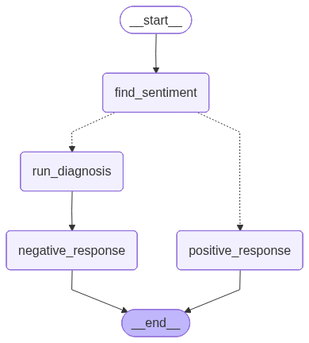

# 🚀 Review Analysis & Auto-Response System (LangGraph)

An AI-powered system that analyzes customer reviews, detects sentiment, and automatically generates intelligent responses using **LangGraph**.

---

## 📌 Project Overview

This project demonstrates how to build a structured LLM workflow using **LangGraph** with conditional branching.

### The system:

- Accepts a customer review  
- Detects sentiment (Positive / Negative)  
- Generates an automatic response  
- If Negative:
  - Classifies issue type  
  - Detects tone  
  - Assigns urgency level  
  - Generates a structured resolution response  

---

## 🧠 Workflow Architecture

Below is the LangGraph flow used in this project:

```markdown
start
   ↓
find_sentiment
   ↓
 ┌───────────────┬────────────────┐
 │               │                │
Negative      Positive        (Conditional)
 │               │
run_diagnosis   positive_response
 │
negative_response
   ↓
end
```

Or you can include your workflow image:

```markdown

```

---

## ⚙️ Tech Stack

- Python  
- LangGraph  
- OpenAI API  
- Streamlit  
- Structured Output Parsing  

---

## 🔍 Example Outputs

### ✅ Positive Review

**Input:**
```text
This product is very good. I loved it.
```

**Output:**
- Sentiment: Positive  
- Auto-generated appreciation response  

---

### ❌ Negative Review

**Input:**
```text
This product is very bad. I will never order again. The material is not original.
```

**Output:**
- Sentiment: Negative  
- Issue Type: Product Quality  
- Tone: Angry  
- Urgency: High  
- Structured resolution response  

---

## 🚀 How to Run Locally

```bash
git clone https://github.com/sakshi2310/Review-Analysis-Auto-Response-System.git
cd Review-Analysis-Auto-Response-System
pip install -r requirements.txt
streamlit run app.py
```

---

## 🎯 Key Learnings

- Conditional routing using LangGraph  
- Multi-step LLM workflows  
- Structured JSON outputs  
- AI-based customer support automation  
- Sentiment-based response generation  

---

## 📈 Future Improvements

- Add database logging  
- Add memory support  
- Deploy to cloud  
- Improve issue classification categories  
- Add analytics dashboard  

---

## ⭐ Support

If you found this project useful, consider giving it a star!
